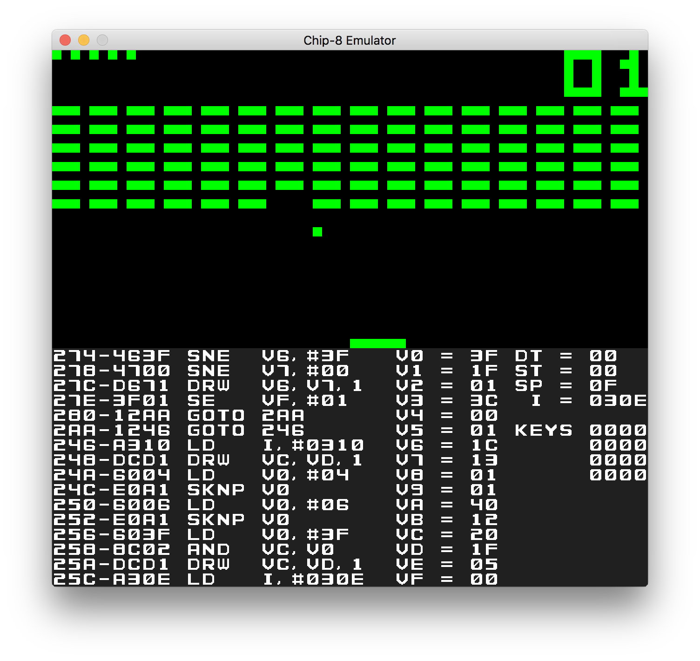

# CHIP-8 Emulator 
A CHIP-8 Emulator in golang



## Dependency

* golang 1.11.x and later (using go module)
* SDL2
  * https://github.com/veandco/go-sdl2

## Usage

* Run
  ```
  go run main.go -f /path/to/rom
  ```

* Debug
  |Key|Description|
  |--|--|
  |SPACE|Pause and Step into|
  |RETURN|Unpause|
  |Z|Reset ROM|


## Key Mapping
In this Emulator, CHIP-8 keys are mapped to below.
```
1 2 3 C ----> 4 5 6 7
4 5 6 D ----> R T Y U
7 8 9 E ----> F G H J
A 0 B F ----> V B N M
```

## ROMs
ROMs in the [games](./games) directory are public domain. From [here](https://www.zophar.net/pdroms/chip8/chip-8-games-pack.html)

If you want to test your emulator, I found test ROM [here](https://www.reddit.com/r/EmuDev/comments/8a4coz/how_do_you_test_your_emu_chip8/dwz5rap)

## Reference
* https://en.wikipedia.org/wiki/CHIP-8
* http://devernay.free.fr/hacks/chip8/C8TECH10.HTM
* http://www.multigesture.net/articles/how-to-write-an-emulator-chip-8-interpreter/